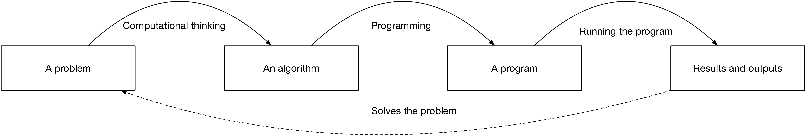
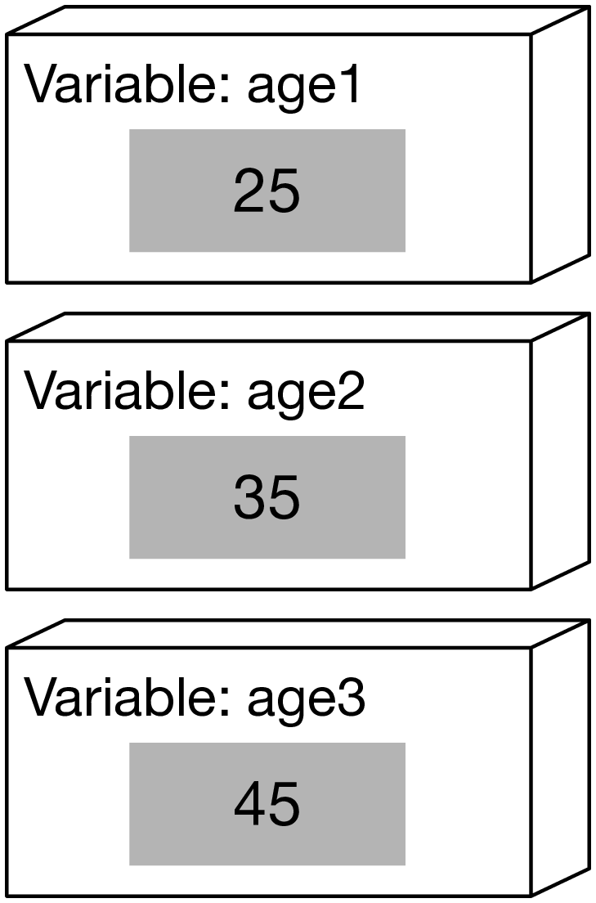
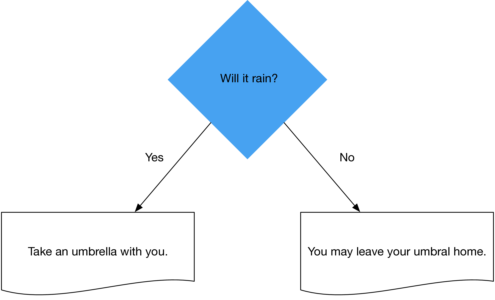

# What is computational thinking?

Computers are able to execute complex calculations, but to do so, they require detailed instructions what to do.
These instructions are _programming_, which just means that you write instructions to the computer and it executes them in a given sequence.
Therefore, it becomes essential to know what kinds of commands need to be executed to get the expected outcome.
This is known as _computational thinking_: reformulating a problem into an algorithm (set of instructions for the computer), which then can be translated into an executable program:



Here is an example of a simple program, can you guess what it does?

```{r}
print( 2 + 2 )
```

`{r}` here is a symbol we use to indicate that the code is written in R language,
`print` is a command to print something and `2 + 2` is a mathematical operation we ask the program to execute.
Let us try something a different, can you make the block below to print your age?
You can edit it directly in the file:

```{r}
print( 2025 - 1900 )
```

Beyond numbers, we can also print text.
To indicate that something is text, we put the text inside quotations like this `"This is text."`
Here is an example:

```{r}
print("This is text.")
```

Can you modify the code above to print your name instead of `This is text.`?

# Variables

Beyond doing mathematics, we often want to store things - be that text, number or something else - to computers memory and access it later.
For this purpose we use _variables_ which you can think as boxes which have _a label_ (the name of the variable) and _contents_, i.e., what is stored to said variable.



We have three variables, named `age1`, `age2` and `age3`.
We can then use these as usual: we can for example calculate what is `age2 - age1`.
In R, this is written like this:

```{r}
age1 <- 25 ## you can also use = instead of <-
age2 <- 35
age3 <- 45 

print( age2 - age1 )
```

As the name variable indicates, its value can change during the execution.
Most interestingly, its value can change in relation to itself.
Before running this code, try to read and guess what it prints!

```{r}
sum <- 0
sum <- sum + 2
sum <- sum + 3
sum <- sum * 2
print( sum )
```

For text in R, one cannot use the `+` operator, rather to merge text together use the `paste` command:

```{r}
text <- paste("Combine", "texts", "and", sum)
print( text )
```

## Exercises

How long Emperor Nero lived and what proportion of that time he was in power. He was born on 37 ad, died on 68 ad, and reigned from 54 to 68 ad.

```{r}
nero_birth_year <- 37
```

A flat costs 250,000 euros and has an area of 75 m2. What is the price of the flat per square metre?

```{r}

```

# Loops and conditions

## Repeating and `for` loop

The above examples we have conducted the commands line by line, in order.
However, often there is a need to _repeate_ some commands;
for example the same code used above to calculate Nero's regin is the same needed to calculate any emperor's regin if we have access to the years.
However, instead of copy-pasting the above lines we rather say to the computer that repeat these command several times.
For that purpuse, programming languages have a `for`-loop.

```{r}
for( stepper in 1:10 ) {
    print( stepper )
}
```

The following code prints out numbers `1`, `2`, ..., `10`.
Similarly we could approach reading a file, line by line

```{r}
data <- read.csv("https://raw.githubusercontent.com/codingsocialscience/data/refs/heads/master/emperors_full.txt", header = F)
for( i in 1:nrow(data) ){
    name <- data[i, 1]
    birth_year <- data[i, 2]
    death_year <- data[i, 3]
    start_of_regin <- data[i, 4]
    end_of_regin <- data[i, 5]
    print( name )
}
```

Use the code you wrote above and modify the example to calculate the age of each emperor's age and length of their regin. 

```{r}
data <- read.csv("https://raw.githubusercontent.com/codingsocialscience/data/refs/heads/master/emperors_full.txt", header = F)
for( i in 1:nrow(data) ){
    name <- data[i, 1]
    birth_year <- data[i, 2]
    death_year <- data[i, 3]
    start_of_regin <- data[i, 4]
    end_of_regin <- data[i, 5]
    print( name )
}
```

## Controlling the execution order and `if`-structure

Often there is a need to only execute some commands if some condition takes place.
For example, you taken an umbrella with you if it will rain:



In various programming languages this is known as the `if`-structure.
If structure relates to some _condition_, checking if some statement is true or false.
For example if we were interested only on the age of Julius Nepos, we could check if the name corresponds to this:
```{r}
data <- read.csv("https://raw.githubusercontent.com/codingsocialscience/data/refs/heads/master/emperors_full.txt", header = F)
for( i in 1:nrow(data) ){
    name <- data[i, 1]
    birth_year <- data[i, 2]
    death_year <- data[i, 3]
    start_of_regin <- data[i, 4]
    end_of_regin <- data[i, 5]
    if( name == "Julius Nepos") {
        print( name )
    }
}
```

The example shows the syntax for a conditional execution:
it checks if name equals to (in R, `==` is read as equals to as one `=` is reserved for assigning a value to variable),
and if it is true, the code _inside_ `{}` is executed; if not, the code is ignored.
Can you modify the code to check for emperors who were likely (but not for sure) killed as emperors?

```{r}
data <- read.csv("https://raw.githubusercontent.com/codingsocialscience/data/refs/heads/master/emperors_full.txt", header = F)
for( i in 1:nrow(data) ){
    name <- data[i, 1]
    birth_year <- data[i, 2]
    death_year <- data[i, 3]
    start_of_regin <- data[i, 4]
    end_of_regin <- data[i, 5]
    if( name == "Julius Nepos") {
        print( name )
    }
}
```

By compleating this exercise, you have now conducted _computational thinking_:
you have taken an actual problem (likely killed as emperors),
considered how our limited data could be used to find such cases,
and then translated this insight into a form that a computer can understand.
This is the essence of computational thinking and programming.

## Exercises

Print all numbers in the range of 1--50.

```{r}

```

# Patterns for computational thinking

We have this far examined

* what variables are and how they can change
* how to repeat instructions
* how to conditionally execute instructions

Now let us put these building blocks into use and combine them into commonly used patterns such as _the gatherer_.
A gatherer is used to accumulate values on the basis of other variables in some manner.
There are several types of gatherers, utilising various approaches to accumulation.

For example, to calculate the mean age of emperors, we would summing all the age values and then dividing the result by the number of emperors.

```{r}
data <- read.csv("https://raw.githubusercontent.com/codingsocialscience/data/refs/heads/master/emperors_full.txt", header = F)

## two gatherers
age_sum <- 0
emperor_count <- 0

for( i in 1:nrow(data) ){
    name <- data[i, 1]
    birth_year <- data[i, 2]
    death_year <- data[i, 3]
    start_of_regin <- data[i, 4]
    end_of_regin <- data[i, 5]
    age <- 0 ## fix me
    age_sum <- age_sum + age
    emperor_count <- emperor_count + 1 
}
```

The statement `age_sum <- age_sum + age` increases age_sum by age.
Similarly, `emperor_count <- emperor_count + 1` increases by one after processing each row.