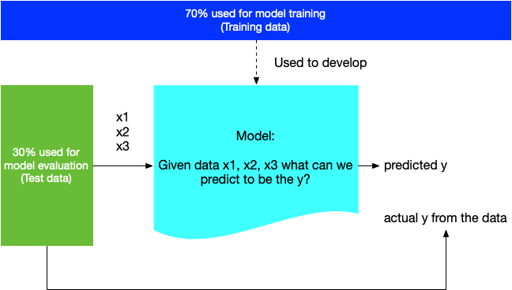

After mastering the basics of computational thinking, we can examine how it can be used in an actual problem. As this is mostly working with a finalised data set, you do not need `for`-loops or `if`-structures here. Often these are required for processing some data in a format that one can do machine learning with it.

# Supervised machine learning

To get a brief overview on the opportunities for supervised machine learning to replace traditional quantitative approaches, let us examine the World Value Survey. First, download a country level data set from [the World Value Survey website](https://www.worldvaluessurvey.org/WVSDocumentationWV7.jsp).

We seek to explain happiness, as measured in Q46:

> Taking all things together, would you say you are
>
> 1.  Very happy
>
> 2.  Rather happy
>
> 3.  Not very happy
>
> 4.  Not at all happy

```{r}
data <- read.csv('F00013120-WVS_Wave_7_Canada_Csv_v5.0.csv', sep = ';')
data$V10 <- as.factor( data$Q46 )
table( data$Q46 )
```

## Train-test split

Traditionally social scientists would use *all* data to develop a linear regression model to see what factors might explain happiness. Data scientists approach this differently. To avoid **over-fitting** the data is split to two partition, one portion of the data set gets used for model-development purposes only (**training data**) while the remaining, often smaller portion, is stored for use only when the model is ready (**test data**).


Once the model (developed with reference to training data) has been developed, the researchers run it against the test data. They can compare the values produced by the model with the actual values represented by the test data, since these values exists for the data.



We use a general purpose library [caret](https://www.rdocumentation.org/packages/caret/) to work with supervised machine learning.

```{r}
install.packages("caret")
library( caret )
```

Here we split the data so that 70% belong to the training data and remaining 30% is used for testing purposes.

```{r}
index <- createDataPartition(y=data$Q46, p=0.7, list=FALSE)
train <- data[index,]
test <- data[-index,]
```

`{r} ## checking the two different datasets} table( train$Q46 ) table( test$Q46 )`

```{r}
## for simplicity, we use a traditional linear regression here, not more advanced machine learning practices yet
## check survey documentation for question formulations

linear_model <- lm( Q46 ~ Q1 + Q2 + Q3 + Q4 + Q5 + Q6, data = train )

summary( linear_model )
```

Traditionally, social scientists would be happy on the above: if we see starts, we know that some questions predict in a significant level happiness question Q46. However, data scientists would say one *should not* use above to make judgment calls as we fit the linear regression with this data. Instead we take the test data and evaluate the model with it.

```{r}
predicted_values <- predict( linear_model , newdata = test )
summary( predicted_values )
```

Using the predicted values, we can compare those to the actual values of Q46 in our test data, for example we can calculate what is the mean difference between the predicted and actual values:

```{r}
difference = abs( test$Q46 - predicted_values )
mean( difference )
```

We can also calculate metrics such as $R^2$ from the data not used for evaluation using its definition:

```{r}
ss_res <- sum((test$Q46 - predicted_values)^2)
ss_tot <- sum((test$Q46 - mean(predicted_values))^2)
r_squared <- 1 - (ss_res / ss_tot)

print(r_squared)
```

### Exercises

1.  💬 Speak with a partner: what do these two metrics compare with the values from the test data? What does it mean?
2.  What other variables would you add to the analysis? Do they improve accuracy? See [survey documentation](https://www.worldvaluessurvey.org/WVSDocumentationWV7.jsp) for the meaning of variables.

## Algorithmic agnosticism

Above we used traditional linear regression, but there are various machine learning algorithms to work on, including random forests, decisions trees, neural networks and support vector machines. How does one choose which one to use? The data science approach is not to choose, but try several different models and evaluate them based on their predictive power to choose the best model for this task. Below we teach several different models on the training data. (This code will produce some warnings. You can just ignore them at this time.)

```{r message=FALSE, warning=FALSE}
model1 <- train( Q46 ~ Q1 + Q2 + Q3 + Q4 + Q5 + Q6, data = train, method = 'rf' ) ## random forest
model2 <- train( Q46 ~ Q1 + Q2 + Q3 + Q4 + Q5 + Q6, data = train, method = 'svmLinear' ) ## support vector machine, with linear
model3 <- train( Q46 ~ Q1 + Q2 + Q3 + Q4 + Q5 + Q6, data = train, method = 'svmRadial' ) ## support vector machine, with radial
model4 <- train( Q46 ~ Q1 + Q2 + Q3 + Q4 + Q5 + Q6, data = train, method = 'nnet' ) ## neural network
```

```{r}
## add here the evaluation code
```

### Exercises

1.  Use the method above to evaluate models 1-4 with the `test` data.

2.  What other methods exists (see [caret documentation](http://topepo.github.io/caret/train-models-by-tag.html) on available models)? Try out them. Do you get better results?

## Parameter tuning

Supervised machine learning models have parameters, which impact how the model behaves. These parameters are specific to each model (see [caret documentation](http://topepo.github.io/caret/train-models-by-tag.html)), but often control how much effort is spent to the training or how critical an incorrect value is seen.

To map out these, we define a **parameter tune grid**, i.e, define which parameter values are to be used in the model training.

```{r}
parameter_grid <-  expand.grid( size = c(1,10,100,1000), decay = 1:10 )
## define that the size gets values 1, 10, 100, 1000 and decay gets all values from 1 to 10.
```

```{r message=FALSE, warning=FALSE}
model5 <- train( Q46 ~ Q1 + Q2 + Q3 + Q4 + Q5 + Q6, data = train, method = 'nnet',
                 tuneGrid = parameter_grid )
## this will take a few minutes. maybe have some coffee?
print( model5 )
```

### Exercise

1.  Is `model5` better than `model4`? Evaluate the models with `test` data.
2.  Do parameter grid for some other model and evaluate it against non-tuned model?
3.  💬 Speak with a partner: Should you use parameter tuning and add a lot of variables or should you carefully choose the model you work with?

## Cross validation

Another trick of the trade is cross-validation, where the training data is further split into smaller bits and to allow for a train-test split within this side. It is useful to bring the train-test thinking into the parameter tuning.

```{r message=FALSE, warning=FALSE}
fivefoldcrossvalidation <- trainControl(
                            method = "repeatedcv",
                            number = 5, ## split the data to 5 segments to use for training
                            repeats = 10 ## repeated ten times
                           )

model6 <- train( Q46 ~ Q1 + Q2 + Q3 + Q4 + Q5 + Q6, data = train, method = 'nnet',
                 tuneGrid = parameter_grid, trControl = fivefoldcrossvalidation  )
## this will again take some time
```

### Exercises

1.  Is `model6` better than `model5`? Evaluate the models with `test` data.
2.  Do five-fold cross validation for some other modell and evaluate it against non-tuned model?
