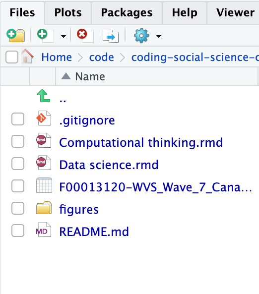
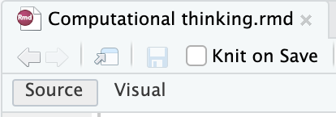
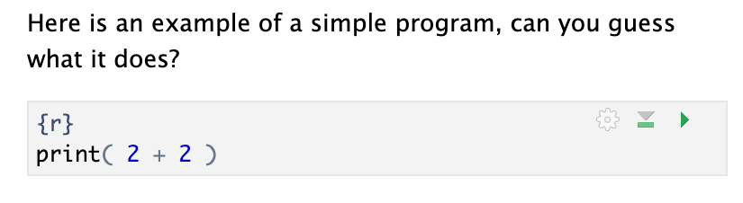

# Computational thinking and social sciences: A crash course

This engaging workshop offers a comprehensive introduction to the fundamental components of computational thinking and programming, tailored specifically for social scientists.
Participants will explore key programming concepts, including variables, if-statements, and for-loops, while gaining a deeper understanding of how programming involves issuing precise commands that a computer executes step-by-step.
We therefore train how social scientists can translate their research questions into computational problems that a computer can effectively address;
thus trying to find a balance between more advanced methods and more substantive social science questions.

Moving beyond foundational programming skills, the workshop explores how to bridge computational methods to usual social science methods.
Therefore, we quickly explore practical applications of machine learning in analysing survey data and focus on data scientists' strategies to enhance accuracy and predictability in their models; discussing how such strategies can be applied in social science questions.

## Before the workshop

1. Please install [RStudio](https://posit.co/downloads/) before the workshop.
1. Download [the examples](https://github.com/codingsocialscience/crash-course/archive/refs/heads/main.zip) used during the workshop and unzip it into a new folder.
1. Download [World Value Survey dataset for some country](https://www.worldvaluessurvey.org/WVSDocumentationWV7.jsp) and store it in the same folder as the materials you just unzipped.

## Using RStudio and RMarkdown files

1. Open a project and search the folder you created in step 2 above.
1. From the file tabs, open `Computational thinking.rmd`:

3. Once opened, choose a visual display:

4. After this, you should see text and code segments:

To execute or run the code in the code block, you need to press the green play button.
You can edit the code directly inline, i.e., type new commands there and then just execute it.

## Get deeper?

The examples and style used here follows the book [Computational Thinking and Social Science](https://uk.sagepub.com/en-gb/eur/computational-thinking-and-social-science/book268542).
We focus on Chapters 2 and 3 in this crash course.

